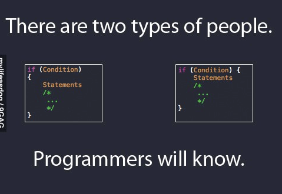

There are millions of programmers around the world, and every one of them has their own way of coding. How a person code reveals a lot about themselves, from their thought process to how meticulous or careless one may be. No matter what type of programmer someone may be, it is essential to remember that coding standards play an important part in improving one's knowledge of programming languages and the quality of their work. Most of the time, we don't think about how our code looks or is presented. I used to believe that as long our code runs properly and works like it's supposed to, we've done a good job. However, that is not the case; using coding standards has a much more significant impact than purely aesthetic reasons. 

## Importance 

Readability is an important result of coding standards. Instead of wasting hours and hours trying to decipher a piece of code, readability allows for others and also for yourself to look back at a piece of code and comprehend and understand it much faster. 

Branching off of readability comes reusability. Using coding standards will cut time on the work you do on future projects as well. This is because you will be able to look back and reuse the code more efficiently while boosting productivity with methodologies you've already encountered previously. As you can see, coding standards have a domino effect on one's ability to code, and it is something that I believe will be very beneficial to one in practice. 

## Implementing Coding Standards 

The key to properly enforcing coding standards is to have a tool readily available when coding and have it run regularly. Tools are available in all types of programming languages, such as ESLint, checkstyle, rubocop, pylint. Actually listening to the tools and fixing the errors found are an important part of the process. Most people are able to disregard the errors and still compile code just fine.  

## ESLint 

I had just recently been introduced to ESLint, and it's been a very helpful tool for improving my javascript projects in IntelliJ Idea. It was cool to see that it not only fixes indentation errors or spacing errors but suggests declaring variables differently depending on how it's used in the code. Although the errors fixed are not significant enough to crash your code, it does help deepen my understanding of coding in general. 

Overall it's quite satisfying seeing the end result of my code using ESLint. I always find myself learning something new through the process of using it. I do look forward to continuing to use it through the rest of the semester. 

