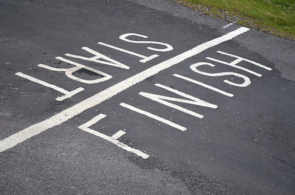

This past semester has been an eye-opening experience for me. I'm fairly new to coding itself; before taking ICS 314 (Software Engineering I), I had absolutely no idea what exactly software engineering entails. It was my first time being introduced to HTML, CSS and Web Development in general. The class was a bit overwhelming at first with so many unfamiliar topics being introduced. But I have to say I’m absolutely grateful for all the new concepts learned and the tools gained during this experience. 

### Functional Programming
It definitely caught my attention when it was first introduced, with functional programming it was easy to turn five lines of code into one. Functional Programming is a style of programming that emphasizes 
It changed the way I thought of programming overall. The digital world is constantly developing as it improves its effienicy, 

### UI Frameworks 
User Interface Frameworks has been an crucial tool during my final project within this course. We specifically used React-Bootstrap, it allows a user to use premade sets of css and javascript functions to facilitate the layout of webpages. For our project we were instructed to create a user-friendly site catered to the students of our university. The experience of building your own website with the use of UI Frameworks is great. React-Bootstrap had made the design aspect easy on our team. My teammates and I were able to focus on the functionality of the site without having to worry about whether or not everything looked aesthetically cohesive. 

### Teamwork
There are a handful of skills I’ve learnt which play a big part into software development. Teamwork had proven itself an important role than I had orginally thought. It was my first time working a group setting when it comes to coding. It was interesting to see everyone's approach when it came to the project itself. We were able to learn from one another's mistakes. 
It has been a very rewarding experience overall and I know this is just the beginning to a longer journey. I look forward to using the information I’ve gained throughout this course in any future endeavours I may encounter. 
