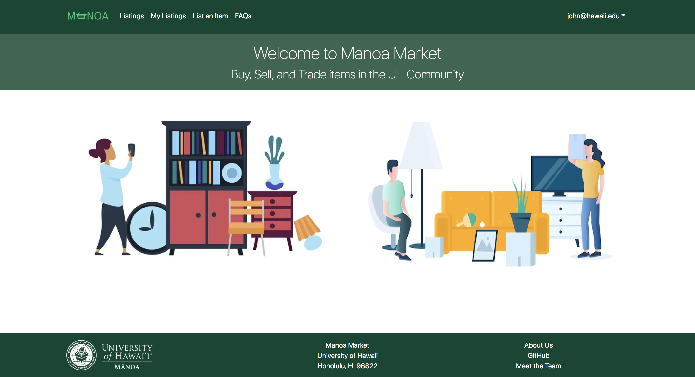
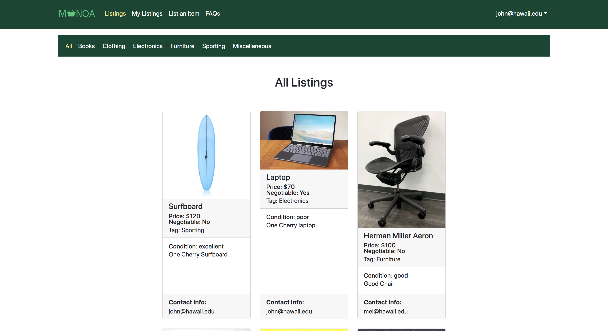

<a href="https://manoa-market.github.io/">Project Homepage</a>

Manoa Market is a web application that I helped create as a team project in ICS 314, Fall 2022. The project allowed me learn how to design and implement a responsive website. <strong>Live Website:</strong> <a href="http://137.184.236.187/">Manoa Market</a>

 

Manoa Market was implemented using <a href="http://meteor.com">Meteor</a>, a JavaScript application platform. We created a website that implements several types of listings including books, furniture, electronics, and etc.

In this project I gained experience with full-stack web application design and associated technologies, including <a href="http://mongodb.com">MongoDB</a> for database storage, the <a href="https://react-bootstrap.netlify.app/getting-started/introduction">React Bootstrap</a> CSS Framework for the user interface, and Javascript for both client and server-side programming. 

Agile Project Management was our team's approach to developing this website. We had broken up the project into smaller projects(milestones), it allowed our team to focus on each feature of the site without getting too overwhelemed. We also had fellow students at UH test out our project and provide feedback whether it be positive or negative to determine whether or not properties needed further improvements. 

