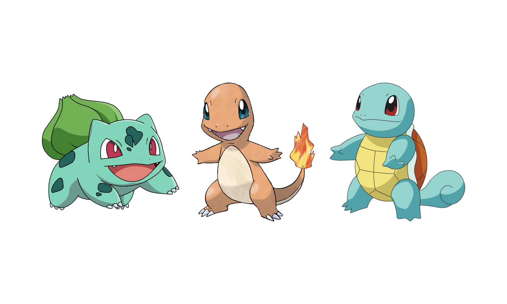

Throughout my ICS 211 class we had worked in various groups to create projects which were built on top of another. In the beginning of the semester we created various Pokemon objects who had multiple constructors and methods based on the Pokemons' stats and info. We then went on to incorportating inheritance to our project, which is a important part of OOP (Object Oriented Programming). We did this by allowing the next evolution of the pokemon to inherit all characteristics from the previous. Later in the semester, the use of binary trees were a cruical element in our final project. We had used them to create binary search trees to create a Pokedex based on pokemon the user has seen or caught during their experience. It was also the first time I got work with GUIs, so it allowed for creative freedom. We were in charge of the complete structure, from buttons, text area size, and pop up menu. 

Through this experience I had the chance to work with multiple people throughout the semester. It was the first time we made use of git and github to complete these group projects. It was very insightful to learn about this platform made for collabrative work. Which made me realize that when it comes to software development, teamwork very important. People are able to notice mistakes other may not see initially and different ideas are able to come together to create more efficent projects.
